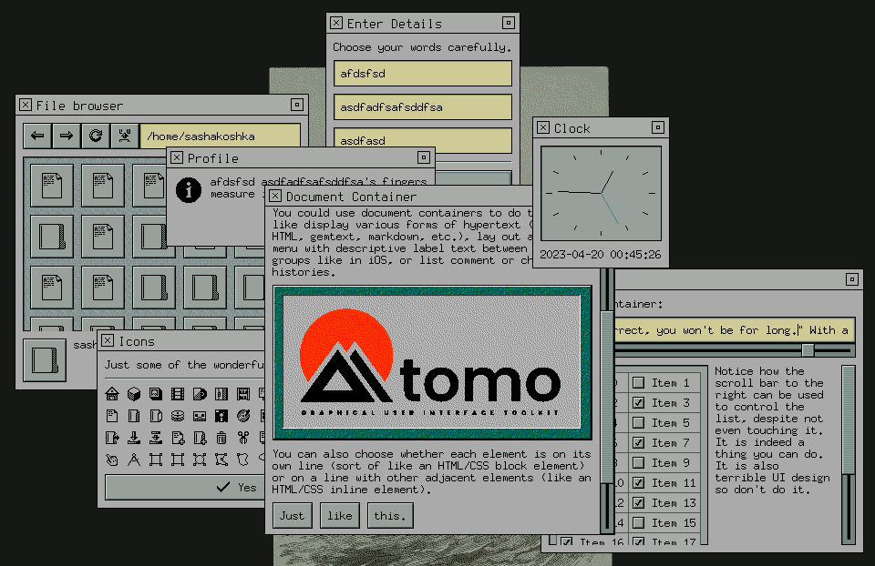

# 

This repository is [mirrored on GitHub](https://github.com/sashakoshka/tomo).

Please note: Tomo is in early development. Some features may not work properly,
and its API may change without notice.

Tomo is a GUI toolkit written in pure Go with minimal external dependencies. It
makes use of Go's unique language features to do more with less. It is also
easily extendable with custom backends and elements.

You can find out more about how to use it by visiting the examples directory,
or pull up its documentation by running `godoc` within the repository. You can
also view it on the web on
 [pkg.go.dev](https://pkg.go.dev/git.tebibyte.media/sashakoshka/tomo).
