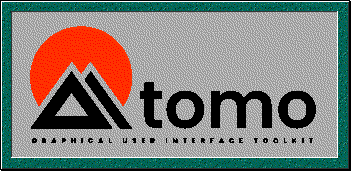

# 

Please note: Tomo is in early development. Some features may not work properly,
and its API may change without notice.

Tomo is a retro-looking GUI toolkit written in pure Go. It is designed with
these goals in mind:

- Modularity: the core of Tomo is mostly composed of interfaces—and the
overwhelming majority of its code resides in pluggable modules. If you don't
need it, then dont import it—and you can be assured it won't be there.
- Extendability: during the design of Tomo's API, use cases such as creating
custom backends, elements, and layouts were given just as much importance as
normal application building. Your custom element is a first-class citizen.
- Independence: Tomo is minimally dependent on code outside of the Go
standard library. Because of this, the file size of a compiled Tomo application
is typically very small.
- Frugality: Tomo foregoes things like animations and anti-aliasing in order to
use a minimal amount of system resources without even having to touch the GPU.
- Consistency: Tomo's design is not only consistent within itself, but also
with the Go standard library. If you've worked with Go in the past, Tomo will
feel pleasantly familliar.

You can find out more about how to use it by visiting the examples directory,
or pull up its documentation by running `godoc` within the repository. You can
also view it on the web on
 [pkg.go.dev](https://pkg.go.dev/git.tebibyte.media/sashakoshka/tomo).
